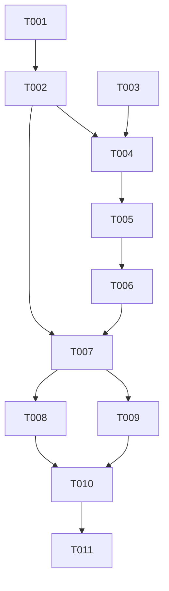

# Tasks: 成就奖章亮起功能

**Input**: Design documents from `spec/achievement-badge-activate/`
**Prerequisites**: plan.md (required), spec.md (required for user stories)

**Tests**: Not explicitly requested — no test tasks included.

**Organization**: Tasks are grouped by user story to enable independent implementation and testing of each story.

## Format: `[ID] [P?] [Story] Description`

- **[P]**: Can run in parallel (different files, no dependencies)
- **[Story]**: Which user story this task belongs to (e.g., US1, US2, US3)
- Include exact file paths in descriptions

## Phase 1: Setup (Shared Infrastructure)

**Purpose**: 无新增基础设施，此阶段为空。项目结构已存在，无新文件需创建。

---

## Phase 2: Foundational (Blocking Prerequisites)

**Purpose**: 为所有用户故事提供共用的基础函数，必须在任何用户故事实现之前完成。

**⚠️ CRITICAL**: No user story work can begin until this phase is complete

- [X] T001 [P] Add `getNewlyUnlockedAchievementIndices(oldMax: number, newMax: number): number[]` function in `features/healthylife/src/main/ets/model/AchievementModel.ets`. The function returns indices of all AchievementList items where `level > oldMax && level <= newMax`, sorted from low to high. Keep existing `getAchievementDoneIndex` unchanged for backward compatibility.
- [X] T002 Modify `updateAchievementStore()` in `features/healthylife/src/main/ets/viewmodel/AchievementStore.ets` to return a new `AchievementStore` instance instead of mutating in place. The function should: (1) record `oldMax = params.achievementStore.maxConsecutiveDays` before any updates; (2) perform the existing consecutive-days logic and Preferences persistence; (3) after updating `maxConsecutiveDays`, call `getNewlyUnlockedAchievementIndices(oldMax, params.achievementStore.maxConsecutiveDays)` to get newly unlocked achievement indices; (4) for each index, call `openAchievementCustomDialog(params.uIContext, index)` — since PromptActionClass is a singleton that replaces content, each call will replace the previous dialog, effectively showing them sequentially; (5) construct and return a new `AchievementStore(maxConsecutiveDays, currentConsecutiveDays, currentDayStatus)` with the updated values.
- [X] T003 Add `refreshAchievementStore: () => Promise<void>` field to `TaskInfoDialogParams` class in `features/healthylife/src/main/ets/viewmodel/dialog/TaskInfoDialogParams.ets`. Update the constructor to accept this new parameter.

**Checkpoint**: Foundation ready — `getNewlyUnlockedAchievementIndices` and `updateAchievementStore` (returning new instance) are available for all user stories.

---

## Phase 3: User Story 1 - 打卡完成后奖章实时亮起 (Priority: P1) 🎯 MVP

**Goal**: 用户打卡完成当天所有任务后，achievementStore 引用更新，导航到成就页面时奖章正确亮起。

**Independent Test**: 开启所有任务→全部打卡→进入成就页→3天奖章应显示为彩色亮起图标。

### Implementation for User Story 1

- [X] T004 [US1] Modify `TaskListComponent` in `features/healthylife/src/main/ets/views/home/TaskListComponent.ets` to pass a `refreshAchievementStore` callback when constructing `TaskInfoDialogParams`. The callback should: call `updateAchievementStore(params)` which now returns a new `AchievementStore` instance, then assign `this.achievementStore = newStore`. This follows the same pattern as the existing `refreshHomeStore` callback. Since the callback needs to reference `params` (which is being constructed), use a two-step approach: construct params with a placeholder callback, then replace the callback after construction, or capture the necessary references (achievementStore, uIContext, homeStore) in the outer closure and call `updateAchievementStore` with a reconstructed params object.
- [X] T005 [US1] Modify `taskClock()` function in `features/healthylife/src/main/ets/views/dialog/TaskClockCustomDialog.ets` to call `params.refreshAchievementStore()` after `updateAchievementStore(params)` — OR — if the approach in T004 uses a self-contained callback, ensure the callback is invoked at the right point in the flow. The existing flow is: (1) clockTask → (2) refreshHomeStore → (3) closeDialog → (4) updateAchievementStore. Add step (5): call `params.refreshAchievementStore()` to trigger the `@Consume` reference update in TaskListComponent.

**Checkpoint**: User Story 1 complete — after clocking in all tasks, navigating to the Achievement page shows the correct badge states.

---

## Phase 4: User Story 2 - 跨越成就级别时所有被跨越的奖章同时解锁 (Priority: P2)

**Goal**: 当连续天数跨越多个成就级别时，成就页面上所有 level <= maxConsecutiveDays 的奖章都亮起。

**Independent Test**: 手动设置 maxConsecutiveDays=7 (via Preferences)，进入成就页→3天和7天奖章都应亮起。

### Implementation for User Story 2

- [X] T006 [US2] Verify that `AchievementComponent` in `features/healthylife/src/main/ets/views/AchievementComponent.ets` already uses `item.level <= this.achievementStore.maxConsecutiveDays` for the active/inactive badge logic. This existing condition already supports all badges with `level <= maxConsecutiveDays` being shown as active. The fix in T002 (returning new instance) + T004/T005 (reference update via @Consume) ensures the UI refreshes correctly when `maxConsecutiveDays` changes. No additional code change needed in AchievementComponent — just verify the existing logic is correct. If the condition uses `===` instead of `<=`, fix it to use `<=`.

**Checkpoint**: User Story 2 complete — when maxConsecutiveDays crosses multiple levels, all badges below that threshold are shown as active.

---

## Phase 5: User Story 3 - 成就解锁弹窗对每个新解锁的奖章分别展示 (Priority: P3)

**Goal**: 跨越多个成就级别时，依次展示每个新解锁成就的动画弹窗。

**Independent Test**: 连续天数从0跳到7时，应先后弹出3天和7天两个成就动画弹窗。

### Implementation for User Story 3

- [X] T007 [US3] Enhance the sequential achievement dialog display in `updateAchievementStore()` in `features/healthylife/src/main/ets/viewmodel/AchievementStore.ets`. The current T002 implementation calls `openAchievementCustomDialog` for each new index, but PromptActionClass.setContentNode + openDialog replaces the previous dialog. To show dialogs sequentially (one after another, not replacing), implement a delay-based approach: iterate through the indices with increasing delays (e.g., each dialog opens after the previous one's animation completes, around 1.5 seconds apart). Use `setTimeout` to stagger the dialog openings so each one has time to display its animation before being replaced by the next.

**Checkpoint**: User Story 3 complete — crossing multiple achievement levels triggers sequential dialog animations.

---

## Phase 6: Polish & Cross-Cutting Concerns

**Purpose**: Improvements that affect multiple user stories

- [X] T008 [P] Review and clean up any unused imports or dead code in modified files
- [X] T009 [P] Verify `getAchievementDoneIndex` (the old function) is still used correctly if referenced elsewhere, or remove it if fully replaced by `getNewlyUnlockedAchievementIndices`

---

## Phase 7: Verification

<!-- verification_scope: build-only -->

**Purpose**: Build and deploy the implemented feature to validate compilation and deployability

- [ ] T010 Build project and fix any compilation errors (invoke build_project; iterate fix → build until success)
- [ ] T011 Deploy application to device/emulator (invoke start_app)

---

## Dependencies & Execution Order

### Phase Dependencies

- **Setup (Phase 1)**: Empty — no dependencies
- **Foundational (Phase 2)**: Must complete before any user story
- **User Stories (Phase 3-5)**: All depend on Foundational (Phase 2)
  - US1 → US2 → US3 (sequential by priority)
- **Polish (Phase 6)**: Depends on all user stories being complete
- **Verification (Phase 7)**: Depends on Polish being complete

### User Story Dependencies

- **User Story 1 (P1)**: Depends on T001, T002, T003 (Foundational)
- **User Story 2 (P2)**: Depends on T004, T005 (US1 complete) — verifies existing logic
- **User Story 3 (P3)**: Depends on T002 (Foundational) — enhances dialog display

### Within Each User Story

- Foundational must complete before any story work
- US1: T004 + T005 are tightly coupled (same flow modification)
- US2: T006 is verification-only (may need minor fix)
- US3: T007 depends on T002's dialog logic being in place

## 📊 Dependency Graph

## ⚡ Parallel Execution Guide

| Phase | Tasks | Required Files | Execution Notes |
|-------|-------|---------------|-----------------|
| Foundational | T001, T003 | AchievementModel.ets, TaskInfoDialogParams.ets | Can run in parallel (different files) |
| Foundational | T002 | AchievementStore.ets | Depends on T001 |
| US1 | T004, T005 | TaskListComponent.ets, TaskClockCustomDialog.ets | Must be sequential (T004 sets up callback, T005 invokes it) |
| US2 | T006 | AchievementComponent.ets | Verification task, may be no-op |
| US3 | T007 | AchievementStore.ets | Enhances T002's dialog logic |
| Polish | T008, T009 | Multiple | Can run in parallel |

---

## Implementation Strategy

### MVP First (User Story 1 Only)

1. Complete Phase 2: Foundational (T001-T003)
2. Complete Phase 3: User Story 1 (T004-T005)
3. **STOP and VALIDATE**: Clock in all tasks → check Achievement page shows badges correctly
4. Build and deploy for testing

### Incremental Delivery

1. Foundational → Foundation ready
2. US1 → Badge refresh works on clock-in → MVP
3. US2 → Cross-level badges all light up
4. US3 → Sequential unlock animations
5. Polish → Clean code

---

## Notes

- [P] tasks = different files, no dependencies
- [Story] label maps task to specific user story for traceability
- The core fix pattern mirrors the HomeStore @Consume fix: return new instance + assign to trigger reference change
- AchievementComponent already uses `level <= maxConsecutiveDays` for active state — this is correct
- PromptActionClass is a singleton — only one dialog at a time, must stagger for sequential display
