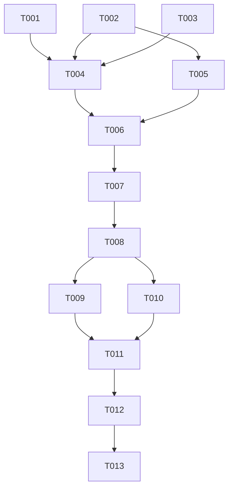

# Tasks: 添加跑步任务种类

**Input**: Design documents from `spec/add-run-task/`
**Prerequisites**: plan.md (required), spec.md (required for user stories)
**Tests**: 无自动化测试;验证通过构建 + 模拟器 UI 验证完成
**Organization**: 任务按用户故事分组,支持独立实现与测试

## Format: `[ID] [P?] [Story] Description`

- **[P]**: 可并行(不同文件,无未完成任务依赖)
- **[Story]**: 所属用户故事(US1/US2/US3)
- 描述含确切文件路径

---

## Phase 1: Setup (Shared Infrastructure)

**Purpose**: 新增资源串与常量,为后续所有故事提供基础数据

- [X] T001 在 `commons/common/src/main/resources/base/element/string.json` 新增 `task_run`(值"跑步")与 `unit_km`(值"公里")资源串;同步在 `en_US/element/string.json`(值"Run"与"km")和 `zh_CN/element/string.json`(值"跑步"与"公里")新增对应条目 在 `commons/common/src/main/resources/{base,en_US,zh_CN}/element/string.json`
- [X] T002 [P] 在 `CommonConstants.ets` 将 `TASK_NUM` 从6改为7,并新增 `PICKER_RANGE_RUN: string[] = ['1','2','3','4','5']` 在 `commons/common/src/main/ets/constants/CommonConstants.ets`
- [X] T003 [P] 放置跑步图标素材 ic_task_run.png 和 ic_dialog_run.png 到 `commons/common/src/main/resources/base/media/`(若用户暂未提供,先复制 ic_task_apple.png 重命名为 ic_task_run.png,复制 ic_dialog_apple.png 重命名为 ic_dialog_run.png 作占位) 在 `commons/common/src/main/resources/base/media/`

---

## Phase 2: Foundational (Blocking Prerequisites)

**Purpose**: taskBaseInfoList 与 defaultTaskInfoList 新增跑步条目,所有 UI 组件依赖此数据

**⚠️ CRITICAL**: 所有用户故事的渲染依赖 taskBaseInfoList[6] 与 defaultTaskInfoList[6] 存在

- [X] T004 在 `TaskBaseModel.ets` 的 `taskBaseInfoList` 数组末尾追加 `new TaskBaseInfo(6, $r('app.string.task_run'), $r('app.media.ic_task_run'), $r('app.media.ic_dialog_run'), $r('app.string.unit_km'), 1, '', PickerType.TEXT, Const.PICKER_RANGE_RUN)`,依赖 T001(资源串)+T002(PICKER_RANGE_RUN)+T003(图标) 在 `commons/common/src/main/ets/model/TaskBaseModel.ets`
- [X] T005 在 `TaskInfo.ets` 的 `defaultTaskInfoList` 数组末尾追加 `new TaskInfo(6, false, '1', '', false, false, '', '', '', -1, false)`,依赖 T002(TASK_NUM=7) 在 `commons/common/src/main/ets/model/database/TaskInfo.ets`

**Checkpoint**: 基础数据就绪,taskBaseInfoList[6] 与 defaultTaskInfoList[6] 可被 UI 组件索引

---

## Phase 3: User Story 1 - 在任务列表中看到并开启跑步任务 (Priority: P1) 🎯 MVP

**Goal**: 跑步任务在首页/AddTaskComponent/EditTaskComponent 可见并可开启

**Independent Test**: 打开任务列表确认跑步出现;进入编辑设置3公里并开启;返回确认开启状态

### Implementation for User Story 1

- [X] T006 [US1] 验证 AddTaskComponent 通用渲染:确认 `TaskInfoApi.queryAllTaskInfo()` 返回含 taskId=6 的7条记录(依赖 checkDefaultTask 补插);确认 `taskBaseInfoList[6]` 的 icon/name 正确渲染;确认点击跑步进入 EditTaskComponent 编辑页面,编辑页面显示目标选择器(1-5公里)+重复开关+开启 Toggle 在 `features/healthylife/src/main/ets/views/task/AddTaskComponent.ets`(只读验证,无需改动代码,若有问题修此处)

**Checkpoint**: US1 可独立验证——跑步任务在列表可见,编辑页面可设置目标并开启

---

## Phase 4: User Story 2 - 打卡跑步并正确累加进度 (Priority: P2)

**Goal**: 每次打卡完成1公里,进度正确累加,达目标标记完成

**Independent Test**: 开启跑步3公里,打卡1次→33%/1/3公里;再打卡→67%/2/3;第3次→100%/已完成

### Implementation for User Story 2

- [X] T007 [US2] 验证打卡弹窗与 clockTask 逻辑:确认 TaskClockCustomDialog 显示"跑步"标题+ic_dialog_run.png 背景;确认打卡后 finValue 累加1(from step=1);确认 DayTaskProgressDialog 进度条与文字正确(如"1/3公里");确认达目标后显示"已完成";确认 DayInfoApi.updateDayByTaskStatus 正确更新当日汇总 在 `features/healthylife/src/main/ets/views/dialog/TaskClockCustomDialog.ets`(只读验证,无需改动代码,若有问题修此处)

**Checkpoint**: US2 可独立验证——打卡累加正确,进度条与数值文字一致

---

## Phase 5: User Story 3 - 跑步任务在各页面一致展示 (Priority: P3)

**Goal**: 跑步在所有页面(列表/编辑/弹窗/进度框/成就卡)图标/名称/单位一致

**Independent Test**: 逐页面核对跑步的图标(ic_task_run)/名称(跑步)/单位(公里)显示正确

### Implementation for User Story 3

- [X] T008 [US3] 验证 AgencyCard 成就卡片:确认 taskBaseInfoList[6] 的 icon/name/unit/step 正确渲染;确认 step>0 分支显示 finValue/targetValue 格式(如"2/3公里") 在 `products/default/src/main/ets/agency/pages/AgencyCard.ets`(只读验证,无需改动代码,若有问题修此处)

**Checkpoint**: US3 可独立验证——跨页面展示一致

---

## Phase 6: Polish & Cross-Cutting Concerns

**Purpose**: 资源占位替换与回归确认

- [X] T009 [P] 若 T003 使用了占位图标,替换为用户提供的真实 ic_task_run.png 和 ic_dialog_run.png;若用户已提供则跳过 在 `commons/common/src/main/resources/base/media/`
- [X] T010 [P] 回归确认:验证现有6种任务(早起/喝水/吃苹果/微笑/刷牙/早睡)的列表展示/编辑/打卡/进度/成就功能未受影响 在 `features/healthylife/` + `products/default/` 各页面

---

## Phase 7: Verification

<!-- verification_scope: build+ui -->

**Purpose**: 构建、部署并 UI 验证跑步任务的完整功能

- [ ] T011 构建 `default@default` 模块并修复编译错误:先 `arkts_check` 校验修改的 `.ets` 文件(`CommonConstants.ets`、`TaskBaseModel.ets`、`TaskInfo.ets`),再 `build_project default@default`;迭代修复 ArkTS 类型/语法错误直至 `BUILD SUCCESSFUL`
- [ ] T012 部署应用到模拟器:`start_app`(模块 `default`,目标 `default`,设备 `127.0.0.1:5555`,Ability `EntryAbility`)
- [ ] T013 UI 验证(`verify_ui`):打开任务列表确认跑步任务出现(图标+名称);进入编辑设置3公里并开启;打卡1次确认进度"1/3公里";再打卡确认"2/3公里";第3次打卡确认"已完成";点击今天日历图标确认进度对话框包含跑步条目;点成就卡片确认跑步正确显示;翻页确认非今天无跑步条目(未开启时)

---

## 📊 Dependency Graph

---

## ⚡ Parallel Execution Guide

| Phase | Tasks | Required Files | Execution Notes |
|-------|------|-----------------|-----------------|
| Setup | T001, T002, T003 | string.json, CommonConstants.ets, media/ | [P] 三者可并行(不同文件) |
| Foundational | T004→T005 | TaskBaseModel.ets, TaskInfo.ets | T004 先(依赖 T001+T002+T003),T005 后(依赖 T002);两者可并行(不同文件,独立索引) |
| US1 | T006 | AddTaskComponent.ets | 只读验证,无需改动(通用渲染) |
| US2 | T007 | TaskClockCustomDialog.ets | 只读验证,无需改动(通用渲染) |
| US3 | T008 | AgencyCard.ets | 只读验证,无需改动(通用渲染) |
| Polish | T009, T010 | media/, 多页面 | [P] 可并行 |
| Verification | T011→T012→T013 | 全部 | 严格顺序 |

---

## Implementation Strategy

### MVP First (User Story 1 Only)

1. T001-T003 Setup → T004-T005 基础数据 → T006 验证可见+可开启
2. **STOP and VALIDATE**: 打开应用确认跑步在列表,编辑并开启
3. 后续 US2/US3 增量验证

### Incremental Delivery

1. T001-T005 基础就绪
2. +US1(T006)→ 跑步可见+可开启 MVP
3. +US2(T007)→ 打卡累加正确
4. +US3(T008)→ 跨页面一致
5. T009-T010 Polish
6. T011-T013 构建+部署+UI 验证

---

## Summary

- **总任务数**:13(T001-T013)
- **每故事任务数**:US1=1(T006),US2=1(T007),US3=1(T008)
- **并行机会**:T001/T002/T003(Setup),T004/T005(Foundational),T009/T010(Polish)
- **独立测试标准**:每故事 Checkpoint 可独立验证
- **MVP 范围**:US1(跑步任务可见+可开启)为最小可用切片
- **关键特点**:纯配置功能,UI 组件零改动(通用渲染);checkDefaultTask 自动升级兼容;图标占位可后续替换

## Notes

- T006/T007/T008 标注为"只读验证"——代码本身无需改动(通用渲染自动适配),但需确认渲染结果正确;若发现问题则修复对应文件
- 跑步 step=1,targetValue='1'-'5',与吃苹果/刷牙完全一致的次数型逻辑;clockTask 的 step>0 分支自动处理
- checkDefaultTask() 对旧数据库(6条)自动补插 taskId=6,无需手迁移
- 图标占位(苹果图标复制)确保编译通过;用户后续提供真实素材替换
