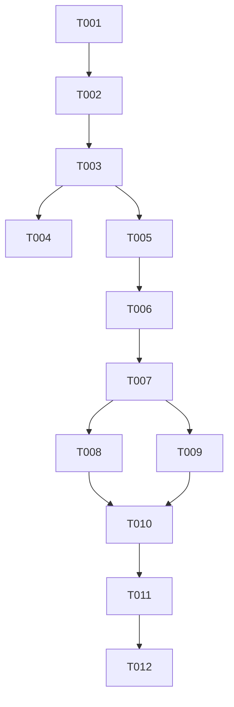

# Tasks: 当天任务进度对话框

**Input**: Design documents from `spec/day-task-progress/`
**Prerequisites**: plan.md (required), spec.md (required for user stories)
**Tests**: 无自动化测试(项目无测试框架);验证通过构建 + 模拟器 UI 验证完成
**Organization**: 任务按用户故事分组,支持独立实现与测试

## Format: `[ID] [P?] [Story] Description`

- **[P]**: 可并行(不同文件,无未完成任务依赖)
- **[Story]**: 所属用户故事(US1/US2/US3)
- 描述含确切文件路径

---

## Phase 1: Setup (Shared Infrastructure)

**Purpose**: 确认环境与文档就绪;项目已存在,无新增模块/依赖

- [X] T001 确认开发环境与文档就绪:核对 `spec/day-task-progress/spec.md` 与 `spec/day-task-progress/plan.md` 已生成;确认模拟器 127.0.0.1:5555 可用、复用现有 features/healthylife 与 commons/common 模块,无需新建项目结构

---

## Phase 2: Foundational (Blocking Prerequisites)

**Purpose**: 所有用户故事依赖的参数类(对话框数据载体)

**⚠️ CRITICAL**: US1/US2/US3 的对话框实现均依赖此参数类

- [X] T002 [P] 创建 `DayTaskProgressDialogParams` 参数类(字段:`date: string`、`taskList: DayTaskInfo[]`,含构造函数;从 `common` 导入 `DayTaskInfo`) 在 `features/healthylife/src/main/ets/viewmodel/dialog/DayTaskProgressDialogParams.ets`

**Checkpoint**: 参数类就绪,可开始 US1 对话框实现

---

## Phase 3: User Story 1 - 点击今天日历图标弹出进度对话框 (Priority: P1) 🎯 MVP

**Goal**: 用户点击今天且已选中的日历图标,弹出居中进度对话框(此阶段列表可占位,后续故事填充进度条)

**Independent Test**: 点击今天已选中图标 → 居中对话框弹出;点击非今天图标 → 仅切换日期不弹框;今天未选中点击 → 先切换不弹框

### Implementation for User Story 1

- [X] T003 [US1] 创建 `DayTaskProgressDialog.ets`:实现 `openDayTaskProgressDialog(uIContext: UIContext, params: DayTaskProgressDialogParams): void`(复用 `PromptActionClass.setContext/setContentNode/openDialog` + `ComponentContent` + `wrapBuilder`)与 `@Builder dayTaskProgressDialogBuilder(params)` 骨架(标题"今日进度" + 日期 + 占位列表区),从 `common` 导入 `PromptActionClass`/`CommonConstants`/`taskBaseInfoList`/`DayTaskInfo`,从 `../viewmodel/dialog/DayTaskProgressDialogParams` 导入参数类 在 `features/healthylife/src/main/ets/views/dialog/DayTaskProgressDialog.ets`
- [X] T004 [US1] 改造 `WeekCalendarComponent.dayOfWeekBuilder` 的 `.onClick`:`selectedDay === index` 分支内,若 `this.homeStore.checkCurrentDay()` 为真则调 `openDayTaskProgressDialog(this.getUIContext(), new DayTaskProgressDialogParams(this.homeStore.currentDate, this.homeStore.taskList))`,否则保持 `return`;`selectedDay !== index` 分支保持原 `refreshDateInfo(index - this.homeStore.selectedDay)` 切换逻辑不变;导入 `openDayTaskProgressDialog` 与 `DayTaskProgressDialogParams` 在 `features/healthylife/src/main/ets/views/home/WeekCalendarComponent.ets`

**Checkpoint**: US1 可独立测试——点击今天已选中图标弹出对话框(列表占位);非今天点击仅切换

---

## Phase 4: User Story 2 - 按任务类型正确展示进度 (Priority: P2)

**Goal**: 对话框内每个任务条目按类型展示进度条与文字:布尔型(早起/早睡)0%/100%;次数型(喝水/吃苹果/微笑/刷牙)按比例 + 数值文字

**Independent Test**: 构造不同完成状态任务,打开对话框核对进度条比例与文字

### Implementation for User Story 2

- [X] T005 [US2] 在 `DayTaskProgressDialog.ets` 实现任务进度条子 `@Builder`(Row{`Image(taskBaseInfoList[taskId].icon)` + Column{`Text(name)` + `Progress({value:进度值, total:100, type:Linear})`.color(品牌色) + 文字行}});进度算法:布尔型(`taskBaseInfoList[taskId].step === 0`)进度=`isDone?100:0`;次数型(`step > 0`)进度=`Math.min(100, Math.round(Number(item.finValue||'0')/Number(item.targetValue)*100))`;文字行复用现有 `targetValueBuilder` 约定(`isDone` 显示 `app.string.was_done`,否则 `finValue||'--'` / `targetValue` / `unit`) 在 `features/healthylife/src/main/ets/views/dialog/DayTaskProgressDialog.ets`
- [X] T006 [US2] 在 `dayTaskProgressDialogBuilder` 用 `ForEach(params.taskList, (item: DayTaskInfo) => this.进度条子Builder(item))` 渲染进度条;`params.taskList.length === 0` 时显示空状态提示文字("今天还没有开启的任务") 在 `features/healthylife/src/main/ets/views/dialog/DayTaskProgressDialog.ets`

**Checkpoint**: US2 可独立测试——进度按类型正确,数值文字与进度条一致

---

## Phase 5: User Story 3 - 关闭对话框并恢复正常交互 (Priority: P3)

**Goal**: 点对话框外部空白或关闭按钮可关闭,关闭后主页交互恢复

**Independent Test**: 打开对话框后点外部/关闭按钮 → 对话框消失;关闭后可再次点击今天图标重开

### Implementation for User Story 3

- [X] T007 [US3] 在 `DayTaskProgressDialog.ets` 实现点外部关闭:`ComponentContent` 根容器 `Column`(width/height 100% 透明背景)`.onClick(() => PromptActionClass.closeDialog())`;内层卡片 `Column` `.onClick((e: ClickEvent) => e.stopPropagation())` 阻止冒泡防误关;底部"关闭"`Button` `.onClick(() => PromptActionClass.closeDialog())` 在 `features/healthylife/src/main/ets/views/dialog/DayTaskProgressDialog.ets`

**Checkpoint**: US3 可独立测试——点外部/关闭按钮关闭,重开正常

---

## Phase 6: Polish & Cross-Cutting Concerns

**Purpose**: 样式与资源串细化,影响整体观感

- [X] T008 [P] 样式细化:进度条前景色用 `sys.color.brand`、字体字号/字重对齐 `TaskListComponent` 与 `TaskClockCustomDialog`、卡片圆角与内边距、对话框宽度适配(建议 `default_316` 或可滚动列表) 在 `features/healthylife/src/main/ets/views/dialog/DayTaskProgressDialog.ets`
- [X] T009 [P] 资源串整理:确认"今日进度"标题与"今天还没有开启的任务"空状态文案——优先复用现有 `app.string` 条目,无则新增 `features/healthylife/src/main/resources/base/element/string.json`(及 zh-Hans/en_US 若需)条目 在 `features/healthylife/src/main/resources/`

---

## Phase 7: Verification

<!-- verification_scope: build+ui -->

**Purpose**: 构建、部署并 UI 验证实现的对话框功能

- [ ] T010 构建 `default@default` 模块并修复编译错误:先 `arkts_check` 校验新增/改造的 `.ets` 文件(`DayTaskProgressDialog.ets`、`DayTaskProgressDialogParams.ets`、`WeekCalendarComponent.ets`),再 `build_project default@default`;迭代修复 ArkTS 类型/语法错误直至 `BUILD SUCCESSFUL`
- [ ] T011 部署应用到模拟器:`start_app`(模块 `default`,目标 `default`,设备 `127.0.0.1:5555`,Ability `EntryAbility`)
- [ ] T012 UI 验证(`verify_ui`):点击今天已选中的日历图标弹出居中进度对话框;核对进度按任务类型正确(布尔型 0%/100%,次数型比例 + 数值文字);点外部空白或关闭按钮关闭对话框;非今天点击仅切换日期不弹框;今天未选中点击先切换不弹框

---

## 📊 Dependency Graph

---

## ⚡ Parallel Execution Guide

| Phase | Tasks | Required Files | Execution Notes |
|-------|------|-----------------|-----------------|
| Setup | T001 | spec 文档 | 确认环境,无代码改动 |
| Foundational | T002 | `DayTaskProgressDialogParams.ets` | 独立参数类,可先行 |
| US1 | T003→T004 | `DayTaskProgressDialog.ets`, `WeekCalendarComponent.ets` | T003 先建对话框骨架,T004 接入触发点;完成后可人工测试弹框(列表占位) |
| US2 | T005→T006 | `DayTaskProgressDialog.ets` | T005 进度条子 Builder + 算法,T006 接入 ForEach + 空状态 |
| US3 | T007 | `DayTaskProgressDialog.ets` | 点外部关闭 + stopPropagation + 关闭按钮 |
| Polish | T008, T009 | `DayTaskProgressDialog.ets`, resources | [P] 不同关注点(样式 vs 资源串)可并行 |
| Verification | T010→T011→T012 | 全部 | 严格顺序:构建→部署→UI 验证 |

---

## Implementation Strategy

### MVP First (User Story 1 Only)

1. T001 确认环境 → T002 参数类 → T003 对话框骨架 → T004 触发点接入
2. **STOP and VALIDATE**: 点击今天已选中图标 → 对话框弹出(列表占位)
3. 后续 US2/US3 在此基础上增量

### Incremental Delivery

1. T001-T002 基础就绪
2. +US1(T003-T004)→ 弹框能力 MVP
3. +US2(T005-T006)→ 进度条正确展示
4. +US3(T007)→ 点外部关闭交互完整
5. T008-T009 样式与资源串打磨
6. T010-T012 构建+部署+UI 验证

---

## Summary

- **总任务数**:12(T001-T012)
- **每故事任务数**:US1=2(T003,T004)、US2=2(T005,T006)、US3=1(T007)
- **并行机会**:T002(Foundational 独立)、T008/T009(Polish 样式 vs 资源串)
- **独立测试标准**:每故事 Checkpoint 可独立验证(弹框/进度/关闭)
- **MVP 范围**:US1(点击今天图标弹出对话框)为最小可用切片
- **关键依赖链**:T002→T003→{T004,T005→T006→T007}→{T008,T009}→T010→T011→T012

## Notes

- [P] 任务 = 不同文件/不同关注点,无未完成依赖
- 对话框为快照模式:打开瞬间读 `homeStore.taskList`,不随打卡实时刷新;关闭重开反映最新
- `WeekCalendarComponent` 改造仅动 `onClick` 的 `selectedDay===index` 分支,翻页/切换逻辑不变,回归风险低
- 验证阶段 UI 验证为 build+ui 范围,需对 3 个用户故事逐个 verify
