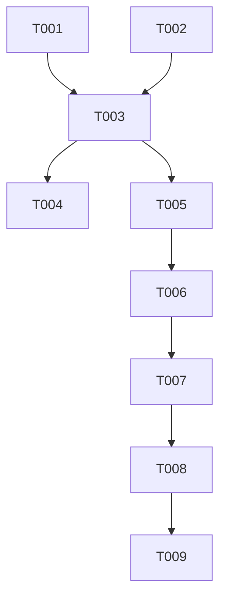

# Tasks: 月度打卡视图弹窗

**Input**: Design documents from `spec/monthly-checkin-view/`
**Prerequisites**: plan.md (required), spec.md (required for user stories)
**Tests**: 无自动化测试;验证通过构建完成
**Organization**: 任务按用户故事分组,支持独立实现与测试

## Format: `[ID] [P?] [Story] Description`

- **[P]**: 可并行(不同文件,无未完成任务依赖)
- **[Story]**: 所属用户故事(US1/US2/US3)
- 描述含确切文件路径

---

## Phase 1: Setup (Shared Infrastructure)

**Purpose**: 新增资源串,为后续所有故事提供基础

- [X] T001 在 `commons/common/src/main/resources/base/element/string.json` 新增 `monthly_checkin`(值"月度打卡")资源串;同步在 `en_US/element/string.json`(值"Monthly Check-in")和 `zh_CN/element/string.json`(值"月度打卡")新增对应条目 在 `commons/common/src/main/resources/{base,en_US,zh_CN}/element/string.json`

---

## Phase 2: Foundational (Blocking Prerequisites)

**Purpose**: 创建弹窗参数类,所有用户故事依赖此基础结构

**⚠️ CRITICAL**: 弹窗参数类是所有用户故事的渲染前提

- [X] T002 新建 `MonthlyCheckinDialogParams.ets` 参数类,包含 currentDate: string 字段(构造函数赋值),用于定位初始显示月份 在 `features/healthylife/src/main/ets/viewmodel/dialog/MonthlyCheckinDialogParams.ets`

---

## Phase 3: User Story 1 - 打开月度打卡视图 (Priority: P1) 🎯 MVP

**Goal**: 点击导航栏右侧图标弹居中月视图,显示当月日历+每天完成率%+进度图标,点外部/取消关闭

**Independent Test**: 点击导航右侧图标→弹窗出现→显示当月日历网格→每天有完成率数字+状态图标→点击弹窗外或取消按钮关闭

### Implementation for User Story 1

- [X] T003 [US1] 新建 `MonthlyCheckinDialog.ets`,实现 openMonthlyCheckinDialog 函数(PromptActionClass.setContext+setContentNode+setOptions(Center)+openDialog)和 monthlyCheckinDialogBuilder @Builder 函数;Builder 内:Stack(背景层onClick closeDialog + 卡片层);卡片含:标题Text(monthly_checkin)+月份导航Row(左箭头+年月文字+右箭头)+星期头Row(周一~周日,复用WEEK_SHORTHAND_LIST)+Grid(columnsTemplate 7列,ForEach格子);格子内容:进度图标Image(progressImg)+百分比Text;未来日期:灰色背景+无图标无百分比;取消Button(cancel,onClick closeDialog);依赖 T001(资源串)+T002(参数类) 在 `features/healthylife/src/main/ets/views/dialog/MonthlyCheckinDialog.ets`
- [X] T004 [US1] 在 WeekCalendarComponent 日期导航 Row 中 chevron_right 之后新增 SymbolGlyph($r('sys.symbol.calendar')),fontColor icon_secondary,fontSize default_18,clickEffect HEAVY,onClick 调用 openMonthlyCheckinDialog(this.getUIContext(), new MonthlyCheckinDialogParams(this.homeStore.currentDate));添加 import(openMonthlyCheckinDialog+MonthlyCheckinDialogParams) 在 `features/healthylife/src/main/ets/views/home/WeekCalendarComponent.ets`

**Checkpoint**: US1 可独立验证——点击日历图标弹出月视图,当月打卡数据正确显示,点外部/取消关闭

---

## Phase 4: User Story 2 - 切换月份查看历史打卡 (Priority: P2)

**Goal**: 月视图中左右箭头切换月份,查看上/下月打卡状态

**Independent Test**: 打开月视图→点击左箭头→显示上个月日历→点击右箭头→回到当前月

### Implementation for User Story 2

- [X] T005 [US2] 在 MonthlyCheckinDialog.ets 的 @Builder 函数中实现月份切换逻辑:维护 @State currentYear/currentMonth;左箭头onClick→月份-1(1月则year-1,month=12)→调用 recomputeMonthData 重新查询;右箭头onClick→月份+1(12月则year+1,month=1)→调用 recomputeMonthData;月份文字用 Intl.DateTimeFormat 格式化;recomputeMonthData:计算月首星期偏移→计算月天数→逐天 queryByKey→组装 MonthDayCellData 数组→更新 @State monthData 触发 Grid 刷新 在 `features/healthylife/src/main/ets/views/dialog/MonthlyCheckinDialog.ets`

**Checkpoint**: US2 可独立验证——月份切换正常,上/下月打卡数据正确显示

---

## Phase 5: User Story 3 - 未来日期和空数据的显示 (Priority: P3)

**Goal**: 未来日期灰色不可交互;历史无记录显示ic_home_undone+0%

**Independent Test**: 切换到下个月→全部灰色;历史无记录天→undone+0%

### Implementation for User Story 3

- [X] T006 [US3] 在 MonthlyCheckinDialog.ets 的格子渲染中实现未来日期判定:dateStr > convertDate2Str(new Date()) 则 isFuture=true;isFuture 格子:灰色背景(backgroundColor $r('sys.color.container')或类似灰色),无进度图标,无百分比文字,onClick无操作;非未来日期但 queryByKey 返回 null:percentage=0,progressImg=ic_home_undone;dayInfo.targetTaskNum===0:同上 在 `features/healthylife/src/main/ets/views/dialog/MonthlyCheckinDialog.ets`

**Checkpoint**: US3 可独立验证——未来灰色,空数据0%+undone图标

---

## Phase 6: Polish & Cross-Cutting Concerns

**Purpose**: 边界情况与回归确认

- [X] T007 [P] 回归确认:验证现有功能(周历切换/点击今天弹进度框/打卡/任务列表)未受影响;验证月视图弹窗不影响其他弹窗(TaskClockCustomDialog/DayTaskProgressDialog)的开关 在 `features/healthylife/` + `products/default/` 各页面

---

## Phase 7: Verification

<!-- verification_scope: build-only -->

**Purpose**: 构建并部署验证

- [X] T008 构建 `default@default` 模块并修复编译错误:先 `arkts_check` 校验修改的 `.ets` 文件(`MonthlyCheckinDialogParams.ets`、`MonthlyCheckinDialog.ets`、`WeekCalendarComponent.ets`),再 `build_project default@default`;迭代修复 ArkTS 类型/语法错误直至 `BUILD SUCCESSFUL` — ✅ 2次构建,修复了 sys.color.container→sys.color.background_tertiary 和 sys.float.corner_radius_level1→app.float.default_8
- [X] T009 部署应用到模拟器:`start_app`(模块 `default`,目标 `default`,设备 `127.0.0.1:5555`,Ability `EntryAbility`) — ✅ 部署成功

---

## 📊 Dependency Graph

---

## ⚡ Parallel Execution Guide

| Phase | Tasks | Required Files | Execution Notes |
|-------|-------|----------------|-----------------|
| Setup | T001 | string.json × 3 | 单任务 |
| Foundational | T002 | MonthlyCheckinDialogParams.ets | 单任务,依赖 T001 |
| US1 | T003→T004 | MonthlyCheckinDialog.ets, WeekCalendarComponent.ets | T003 先(核心弹窗),T004 后(入口接入) |
| US2 | T005 | MonthlyCheckinDialog.ets | 月份切换逻辑 |
| US3 | T006 | MonthlyCheckinDialog.ets | 未来日期判定 |
| Polish | T007 | 多页面 | 只读验证 |
| Verification | T008→T009 | 全部 | 严格顺序 |

---

## Implementation Strategy

### MVP First (User Story 1 Only)

1. T001 Setup → T002 参数类 → T003+T004 弹窗+入口
2. **STOP and VALIDATE**: 打开应用→点击日历图标→月视图弹窗出现→显示当月数据→关闭
3. 后续 US2/US3 增量实现

### Incremental Delivery

1. T001-T002 基础就绪
2. +US1(T003+T004)→ 月视图弹窗MVP
3. +US2(T005)→ 月份切换
4. +US3(T006)→ 未来日期+空数据
5. T007 Polish
6. T008-T009 构建+部署

---

## Notes

- T003 是核心任务,实现 openMonthlyCheckinDialog+@Builder+Grid+格子渲染+取消按钮+点外部关闭;T005/T006 在此基础上增量修改
- PromptActionClass 全局单例:每次 open 前必须 setContext+setContentNode+setOptions,避免与其他弹窗冲突
- 月份切换的 recomputeMonthData 是 async 函数,逐天 queryByKey 至多31次;结果存 @State monthData 数组触发 Grid 刷新
- 日历周一起始:月首日 getDay()===0(周日)→偏移6个空格子;getDay()===1(周一)→偏移0;以此类推
- 月份文字使用 Intl.DateTimeFormat 自动适配中英文,不新增月份名资源串
- 格子渲染:进度图标大小约20vp,百分比文字约10fp;未来日期格子灰底无内容;空格子(月首偏移)完全空白
- DayInfo.calculatePercentage()和DayInfo.getProgressImg()直接复用,不重写逻辑
- @State monthData 数组的 key 函数用 dateStr+(isFuture?'f':'p')+percentage 确保唯一性和刷新
