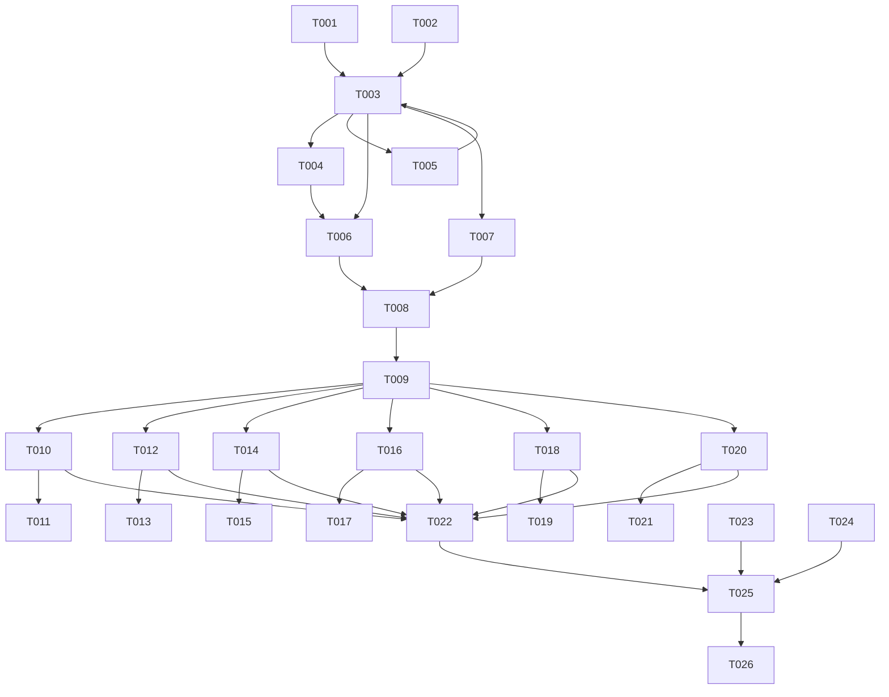

# Tasks: 个人资料编辑功能

**Input**: Design documents from `spec/profile-edit/`
**Prerequisites**: plan.md (required), spec.md (required for user stories)

**Tests**: Not requested — no test tasks included.

**Organization**: Tasks grouped by user story for independent implementation and testing.

## Format: `[ID] [P?] [Story] Description`

- **[P]**: Can run in parallel (different files, no dependencies)
- **[Story]**: Which user story this task belongs to (e.g., US1, US2)
- Include exact file paths in descriptions

## Phase 1: Setup (Shared Infrastructure)

**Purpose**: Data model, ViewModel, Preferences keys, string resources — foundation for all user stories.

- [X] T001 Add Preferences key constants (USER_AVATAR_URI, USER_NICKNAME, USER_GENDER, USER_BIRTHDAY, USER_HEIGHT, USER_WEIGHT) and profile-related string resources (avatar/nickname/gender/birthday/height/weight labels, not_set placeholder, save button, male/female, cm/kg units, profile_edit_title, select_from_gallery) in `commons/common/src/main/ets/constants/CommonConstants.ets` and `commons/common/src/main/resources/base/element/string.json` and `commons/common/src/main/resources/zh_CN/element/string.json` and `commons/common/src/main/resources/en_US/element/string.json`
- [X] T002 [P] Create UserProfile data model class with fields (avatarUri: string, nickname: string, gender: number, birthday: string, height: number, weight: number) in `features/healthylife/src/main/ets/model/UserProfile.ets`
- [X] T003 Create ProfileStore (@Observed class with userProfile: UserProfile) and initProfileStore() / updateProfileField(key, value) functions in `features/healthylife/src/main/ets/viewmodel/ProfileStore.ets`. initProfileStore reads all 6 fields from Preferences and returns new ProfileStore. updateProfileField writes one field, re-reads all, returns new ProfileStore instance.
- [X] T004 Modify HealthyLifePage in `features/healthylife/src/main/ets/pages/HealthyLifePage.ets` to @Provide profileStore, call initProfileStore() in aboutToAppear and assign result
- [X] T005 Extend PreferencesUtils initialization in `commons/common/src/main/ets/utils/PreferencesUtils.ets` to add default values for the 6 new profile keys on first run

---

## Phase 2: Foundational (Blocking Prerequisites)

**Purpose**: Mine page navigation + UserInfoComponent dynamic display — enables all user stories.

**⚠️ CRITICAL**: No user story work can begin until this phase is complete

- [X] T006 Modify MineComponent in `features/healthylife/src/main/ets/views/MineComponent.ets` to add @Consume profileStore, add onClick handler on "个人资料" row: `this.pageStack.pushPathByName('PersonalDataComponent', '')`
- [X] T007 Modify UserInfoComponent in `features/healthylife/src/main/ets/views/mine/UserInfoComponent.ets` to add @Consume profileStore, display dynamic avatar (profileStore.userProfile.avatarUri → Image with clip circle, or fallback person_crop_circle icon), display dynamic nickname (profileStore.userProfile.nickname or "未设置")

**Checkpoint**: Mine page "个人资料" row clickable, UserInfoComponent shows dynamic data from Preferences.

---

## Phase 3: User Story 1 - 查看个人资料列表页 (Priority: P1) 🎯 MVP

**Goal**: 用户点击"个人资料"后导航到列表页，看到6个字段的当前值。

**Independent Test**: 点击"个人资料"→页面展示6行，未设置显示"未设置"。

### Implementation for User Story 1

- [X] T008 Create PersonalDataComponent in `features/healthylife/src/main/ets/views/mine/PersonalDataComponent.ets`. NavDestination page with back button, title "个人资料", Column of 6 rows: (1) Avatar row — left label "头像" + right circle avatar image (30px) + chevron_right; (2) Nickname row — "昵称" + current value or "未设置" + chevron_right; (3) Gender row — "性别" + "男"/"女"/"未设置" + chevron_right; (4) Birthday row — "出生日期" + date or "未设置" + chevron_right; (5) Height row — "身高" + value+"cm" or "未设置" + chevron_right; (6) Weight row — "体重" + value+"kg" or "未设置" + chevron_right. Each row onClick pushes to corresponding edit page. @Consume profileStore for data binding. @Consume('pathStack') for navigation.
- [X] T009 Register PersonalDataComponent route in `features/healthylife/src/main/resources/base/profile/router_map.json` with name "PersonalDataComponent", pageSourceFile "src/main/ets/views/mine/PersonalDataComponent.ets", buildFunction "personalDataBuilder"

**Checkpoint**: Can navigate Mine → PersonalData list page, see all 6 fields with current values.

---

## Phase 4: User Story 2 - 编辑头像 (Priority: P1)

**Goal**: 从图库选择头像图片，持久化显示。

**Independent Test**: 点击头像行→选择图片→头像更新。

### Implementation for User Story 2

- [X] T010 Create AvatarEditComponent in `features/healthylife/src/main/ets/views/profile/AvatarEditComponent.ets`. NavDestination with back button, title "编辑头像". Display current avatar (large circle, 120px). Button "从图库选择" that calls PhotoViewPicker (photoAccessHelper.PhotoViewPicker, PhotoSelectOptions with MIMEType IMAGE_TYPE, maxSelectNumber 1). On select: copy image from photoUris[0] to context.filesDir + '/avatar/avatar.jpg' using fs.copyFileSync (open source URI read-only, open dest CREATE|READ_WRITE, copyFileSync). Call updateProfileField(USER_AVATAR_URI, destPath), assign this.profileStore = newStore. Pop back.
- [X] T011 Register AvatarEditComponent route in router_map.json with name "AvatarEditComponent", buildFunction "avatarEditBuilder"

**Checkpoint**: Avatar selection from gallery works, persists across app restart.

---

## Phase 5: User Story 3 - 编辑昵称 (Priority: P1)

**Goal**: 输入新昵称并保存。

**Independent Test**: 点击昵称行→输入"小明"→保存→昵称更新。

### Implementation for User Story 3

- [X] T012 Create NicknameEditComponent in `features/healthylife/src/main/ets/views/profile/NicknameEditComponent.ets`. NavDestination with back button, title "编辑昵称". TextInput with placeholder "请输入昵称", maxLength 20, current value as initial text. "保存" Button at bottom: if text is empty show toast "昵称不能为空", otherwise call updateProfileField(USER_NICKNAME, text), assign this.profileStore = newStore, pop back.
- [X] T013 Register NicknameEditComponent route in router_map.json

**Checkpoint**: Nickname editing and saving works, updates in UserInfoComponent.

---

## Phase 6: User Story 4 - 编辑性别 (Priority: P2)

**Goal**: 选择男/女，自动保存返回。

**Independent Test**: 点击性别行→选择"男"→自动返回→性别显示"男"。

### Implementation for User Story 4

- [X] T014 Create GenderSelectComponent in `features/healthylife/src/main/ets/views/profile/GenderSelectComponent.ets`. NavDestination with back button, title "选择性别". Two rows: "男" with radio indicator, "女" with radio indicator. Current gender determines which is selected. On click a row: call updateProfileField(USER_GENDER, '1' or '2'), assign this.profileStore = newStore, pop back immediately.
- [X] T015 Register GenderSelectComponent route in router_map.json

**Checkpoint**: Gender selection auto-saves and returns.

---

## Phase 7: User Story 5 - 编辑出生日期 (Priority: P2)

**Goal**: 通过日期选择器选择出生日期。

**Independent Test**: 点击出生日期行→选择日期→保存→日期显示。

### Implementation for User Story 5

- [X] T016 Create BirthdayEditComponent in `features/healthylife/src/main/ets/views/profile/BirthdayEditComponent.ets`. NavDestination with back button, title "编辑出生日期". Display current birthday text. "选择日期" Button: calls this.getUIContext().showDatePickerDialog with start=new Date('1900-01-01'), end=new Date(), selected=current or today, onDateAccept callback sets local @State selectedDate. "保存" Button: format selectedDate as YYYY-MM-DD, call updateProfileField(USER_BIRTHDAY, dateStr), assign this.profileStore = newStore, pop back.
- [X] T017 Register BirthdayEditComponent route in router_map.json

**Checkpoint**: Birthday selection via DatePickerDialog works.

---

## Phase 8: User Story 6 - 编辑身高 (Priority: P2)

**Goal**: 滑轮选择器选择身高。

**Independent Test**: 点击身高行→滑动选择175→保存→身高显示"175cm"。

### Implementation for User Story 8

- [X] T018 Create HeightEditComponent in `features/healthylife/src/main/ets/views/profile/HeightEditComponent.ets`. NavDestination with back button, title "编辑身高". TextPicker with range = string array ['100','101',...,'250'], selected = (currentHeight - 100) or 70 (default 170cm). Unit label "cm" displayed next to picker. "保存" Button: get selected value from picker onChange callback, call updateProfileField(USER_HEIGHT, value), assign this.profileStore = newStore, pop back.
- [X] T019 Register HeightEditComponent route in router_map.json

**Checkpoint**: Height selection via TextPicker works.

---

## Phase 9: User Story 7 - 编辑体重 (Priority: P2)

**Goal**: 滑轮选择器选择体重（0.1kg精度）。

**Independent Test**: 点击体重行→滑动选择65.5→保存→体重显示"65.5kg"。

### Implementation for User Story 9

- [ ] T020 Create WeightEditComponent in `features/healthylife/src/main/ets/views/profile/WeightEditComponent.ets`. NavDestination with back button, title "编辑体重". TextPicker with range = string array ['20.0','20.1',...,'300.0'] (281 elements), selected calculated from currentWeight or default 450 (index for 65.0kg). Unit label "kg" displayed next to picker. "保存" Button: get selected value from picker onChange callback, call updateProfileField(USER_WEIGHT, value), assign this.profileStore = newStore, pop back.
- [ ] T021 Register WeightEditComponent route in router_map.json

**Checkpoint**: Weight selection via TextPicker with 0.1 precision works.

---

## Phase 10: Polish & Cross-Cutting Concerns

**Purpose**: Code cleanup and consistency.

- [ ] T022 [P] Clean up unused imports in all modified and new files
- [ ] T023 [P] Verify all 7 routes are properly registered in router_map.json with correct builder functions
- [ ] T024 [P] Verify ProfileStore @Consume pattern is consistent across all edit pages (each edit page calls updateProfileField → assigns this.profileStore → pops)

---

## Phase 11: Verification

<!-- verification_scope: build-only -->

**Purpose**: Build and deploy the implemented feature to validate compilation and deployability

- [ ] T025 Build project and fix any compilation errors (invoke build_project; iterate fix → build until success)
- [ ] T026 Deploy application to device/emulator (invoke start_app)

---

## Dependencies & Execution Order

### Phase Dependencies

- **Setup (Phase 1)**: Must complete first — provides data model, ViewModel, constants, strings
- **Foundational (Phase 2)**: Depends on Phase 1 — adds navigation and dynamic display
- **US1 (Phase 3)**: Depends on Phase 2 — the list page needs MineComponent onClick
- **US2-US7 (Phase 4-9)**: Each depends on Phase 3 (list page must exist to navigate to edits)
- **Polish (Phase 10)**: Depends on all user stories
- **Verification (Phase 11)**: Depends on Polish

### Parallel Opportunities

- T001, T002 can run in parallel (different files)
- T004, T005 can run in parallel (different files)
- All edit page implementations (T010-T021) can run in parallel after Phase 3 completes — they're independent pages
- T022, T023, T024 can run in parallel (different concerns)

## 📊 Dependency Graph

## ⚡ Parallel Execution Guide

| Phase | Tasks | Required Files | Execution Notes |
|-------|-------|---------------|-----------------|
| Setup | T001, T002 | CommonConstants.ets, string.json x3, UserProfile.ets | Can run in parallel |
| Setup | T003 | ProfileStore.ets | Depends on T001, T002 |
| Setup | T004, T005 | HealthyLifePage.ets, PreferencesUtils.ets | Can run in parallel, both depend on T003 |
| Foundational | T006, T007 | MineComponent.ets, UserInfoComponent.ets | Can run in parallel, both depend on T003+T004 |
| US1 | T008, T009 | PersonalDataComponent.ets, router_map.json | Sequential |
| US2 | T010, T011 | AvatarEditComponent.ets, router_map.json | After T009 |
| US3 | T012, T013 | NicknameEditComponent.ets, router_map.json | After T009, parallel with US2 |
| US4 | T014, T015 | GenderSelectComponent.ets, router_map.json | After T009, parallel with US2-US3 |
| US5 | T016, T017 | BirthdayEditComponent.ets, router_map.json | After T009, parallel with US2-US4 |
| US6 | T018, T019 | HeightEditComponent.ets, router_map.json | After T009, parallel with US2-US5 |
| US7 | T020, T021 | WeightEditComponent.ets, router_map.json | After T009, parallel with US2-US6 |
| Polish | T022, T023, T024 | Multiple | Can run in parallel |

---

## Implementation Strategy

### MVP First (User Story 1 Only)

1. Complete Phase 1-2: Setup + Foundational
2. Complete Phase 3: US1 (PersonalData list page)
3. **STOP and VALIDATE**: Navigate to profile list, see 6 fields
4. Build and deploy

### Incremental Delivery

1. Setup + Foundational → Foundation ready
2. US1 → Profile list page visible → MVP
3. US2-US3 → Avatar + Nickname editing → Core identity
4. US4-US7 → Gender/Birthday/Height/Weight → Full profile
5. Polish → Clean code
